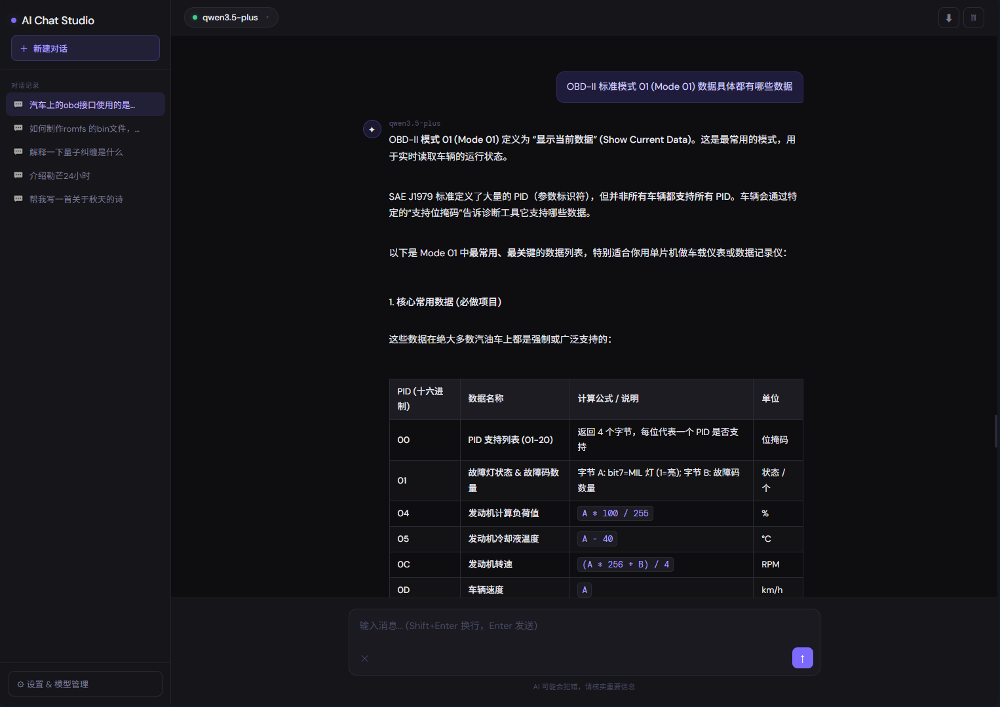

# AI Chat Studio

AI Chat Studio is a modern, lightweight web interface for interacting with various AI models. It features a clean dark-themed UI and comes with a built-in Node.js CORS proxy server to ensure smooth API communication directly from your browser.



## Features

- **Multi-Model Support**: Built-in presets for OpenAI (GPT), Anthropic (Claude), Google (Gemini), Qwen (Tongyi Qianwen), DeepSeek, and Zhipu GLM.
- **Customizable**: Add custom models, configure API keys, and adjust parameters like temperature and system prompts.
- **Streaming Responses**: Full support for real-time streaming of AI responses.
- **Markdown Support**: Messages are rendered with Markdown support for code blocks, tables, and formatting.
- **Session Management**: Automatically saves chat history locally, allowing you to manage multiple conversation sessions.
- **CORS Proxy**: Includes a Node.js proxy server to bypass browser CORS restrictions when calling APIs.

## Prerequisites

- [Node.js](https://nodejs.org/) (v14 or higher recommended)

## Getting Started

1.  **Start the Proxy Server**
    The proxy server is required to handle API requests without CORS issues.
    ```bash
    node proxy.js
    ```
    The server will start on port `8080`.

2.  **Open the Application**
    Open `ai-chat.html` in your web browser.

3.  **Configure Models**
    - Click on the "Settings" icon (gear) in the sidebar.
    - Go to "Add Model" to configure your API keys and endpoints.
    - If a provider requires a proxy (e.g., Anthropic, OpenAI direct calls from browser), ensure the "CORS Proxy URL" is set to `http://localhost:8080` (or your deployed proxy address).

## Usage

- **Select a Model**: Use the dropdown at the top to switch between configured models.
- **Chat**: Type your message and press Enter. Use Shift+Enter for new lines.
- **Settings**: Adjust system prompts and generation parameters in the settings panel.
- **History**: Access past conversations from the sidebar.

## License

This project is licensed under the terms of the LICENSE file included in the repository.
